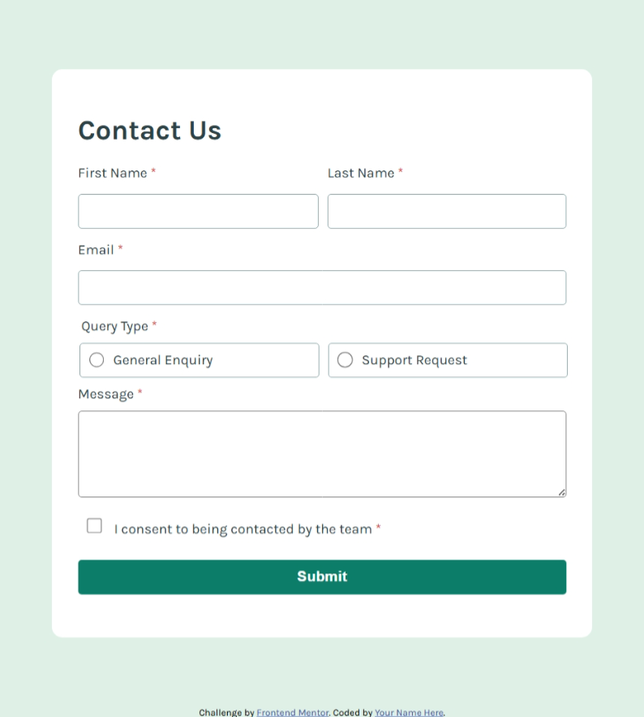

# Frontend Mentor - Contact form solution

This is a solution to the [Contact form challenge on Frontend Mentor](https://www.frontendmentor.io/challenges/contact-form--G-hYlqKJj). Frontend Mentor challenges help you improve your coding skills by building realistic projects. 

## Table of contents

- [Overview](#overview)
  - [The challenge](#the-challenge)
  - [Screenshot](#screenshot)
  - [Links](#links)
- [My process](#my-process)
  - [Built with](#built-with)
  - [What I learned](#what-i-learned)
- [Author](#author)

**Note: Delete this note and update the table of contents based on what sections you keep.**

## Overview

### The challenge

Users should be able to:

- Complete the form and see a success toast message upon successful submission
- Receive form validation messages if:
  - A required field has been missed
  - The email address is not formatted correctly
- Complete the form only using their keyboard
- Have inputs, error messages, and the success message announced on their screen reader
- View the optimal layout for the interface depending on their device's screen size
- See hover and focus states for all interactive elements on the page

### Screenshot


### Links

- Solution URL: [solution URL](https://github.com/scyflix/contact-form-main)
- Live Site URL: [live site](https://scyflix.github.io/contact-form-main/)

## My process

### Built with

- Semantic HTML5 markup
- CSS
- Flexbox
- Mobile-first workflow
-javascript

### What I learned
- Structuring the form accessibly was tricky, especially understanding when to use ```
<label>
 vs <fieldset>
```
 for radio groups.
- My validation logic failed at first because I used else if, which stopped other fields from being checked.
- I struggled with the difference between checking value === "" and using !value.

## Author

- Website - [Abdulroqib Oladipo](https://scyflix.github.io/Abdulroqib-Portfolio/)
- Frontend Mentor - [@scyflix](https://www.frontendmentor.io/profile/scyflix)
- Twitter - [@abdulroqib123](https://x.com/abdulroqib123)


